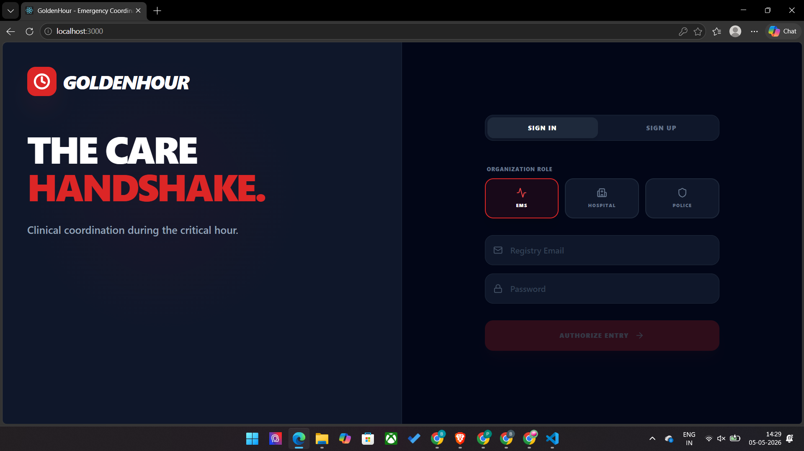

# 🚑 GoldenHour – Real-Time Emergency Coordination Platform

A real-time system that connects ambulances, hospitals, and police to share patient data before arrival, enabling faster emergency response during the Golden Hour.

---

## 🚀 Key Features
- Live patient vitals transmission
- Real-time hospital preparation before arrival
- Role-based dashboards (EMS, Hospital, Police)
- Injury images and case data sharing
- AI-generated medical summaries for doctors

---

## 📸 Application Preview
Login system with role-based access (EMS, Hospital, Police)

---

## 🧰 Tech Stack
- Frontend: React + TypeScript + Vite  
- Backend: Supabase  
- Database: SQL  
- Storage: Supabase Storage  
- AI: Gemini API  

---

## 👨‍💻 My Role
Worked on backend development, implementing real-time data handling and system logic.
